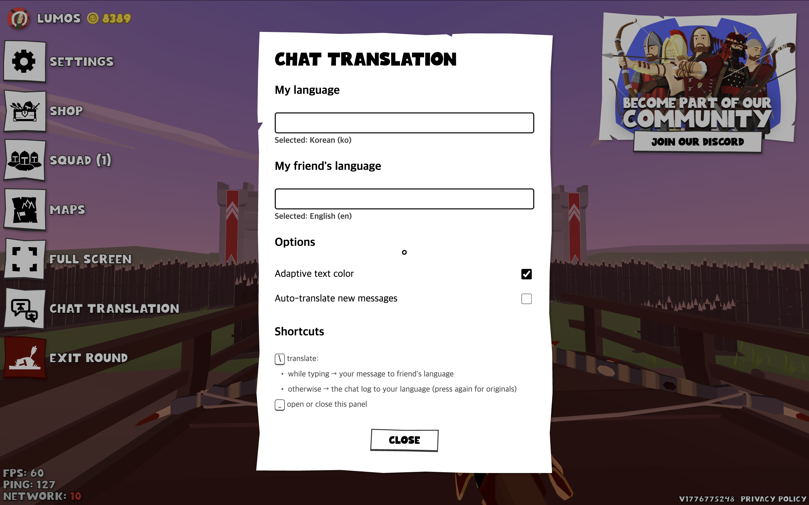

# Userscripts for Narrow One 🏹
> This repository contains JS scripts developed by Lumos to make playing [Narrow One](https://narrow.one) more fun and convenient.

To run these scripts, Tampermonkey (Google Chrome extension) is needed :
* have a look at this [guidline by N1CN](https://github.com/N1CNmod/narrowone-mod#how-to-run-the-scripts-step-by-step-guide)
* or [youtube vedio made by 【/ℕ𝕏/】 𝕶𝖛𝖊𝖝](https://www.youtube.com/watch?v=Cq7HAGtWuQ0)

## 💬 Chat Mod with Translation

Real-time translation and adaptive text color features considering the background to enhance your gameplay experience.

Deepest gratitude and honor to [Wolfart](https://github.com/N1-wolfart)..! 🙏🙏 I developed this by adding some features on original transparent chat UI mod created by [N1CNmod](https://github.com/N1CNmod/narrowone-mod) :)

### Features

* Transparent Chat UI (Original): Replaces the bulky default chat box with a clean, transparent, and non-intrusive interface.
* **Adaptive Text Color:** The script reads the game background in real-time and automatically adjusts the chat text color (switching between dark and light modes with a subtle glow) to ensure maximum readability against any environment.
* **Two-Way Translation:** 
  * **Incoming Chat:** Translate messages from other players into your native language.
  * **Outgoing Chat:** Translate what you are typing into your friend's language instantly before sending.
* **Auto-Translation:** Automatically translates new incoming chat messages as they appear on the screen. (This can be toggled on/off in the settings).
* **No API Key Required:** Uses a lightweight Google Translate backend that works out of the box.

### How to Use (Keybinds)

Click the file named **Chat Mod with Translation**, download it, and upload it on Tampermonkey.
Or you can just copy the script, create a new file in Tampermonkey by clicking `+`, and pasting it.

| Shortcut | Action | Description |
|---|---|---|
| `_`  | Open/Close Settings Menu | Opens the **Chat Translator** panel. Press again to close it. |
| `\` (When not typing) | Translate Chat Log | Press outside the chat input box to instantly translate all currently visible chat messages into your language. Press again to revert to the original messages. (Note : if you are unfamiliar with this shortcut key, don't you worry! `-` from v1.0 still works.) |
| `\`   (When typing) | Translate Your Input | While typing a message in the chat input box, press this to instantly translate your typed text into your designated "Friend's Language." |

### Settings Menu Overview

Press `_` or click 'CHAT TRANSLATION' to access the configuration panel:

| Setting | Description |
|---|---|
| **My language** | Set this to your native language. Incoming chat messages will be translated into this language. |
| **My friend's language** | Set this to the language you want your outgoing messages to be translated into. |
| **Adaptive text color** | Toggle the real-time contrast-aware text color engine. |
| **Auto-translate new messages** | When enabled, any new message popping up in the chat log will be automatically translated to your language. (Disabled by default). |

### Changelog

* **Chat Mod with Translation v1.0** :
** The first version. Added adaptive text color and translation feature on original chat mod made by Wolfart.
* **Chat Mod with Translation v1.1** :
** Modified Settings Medu's UI  just like other Menu's (Settigns, Shop, Squad, etc) in Narrow One
** Modified shortcut keys (You can know translate others' messages and the message you are typing with just one shortcut key `\`)
** Fixed minor bugs related to Google Translator

### Additional Licensing

This script is based on the work of N1CNmod.

The original source code remains the intellectual property of its original author.
All original copyright notices and attributions have been preserved.

The MIT License included in this repository applies only to the original code,
modifications, and additions created by me, Lumos. It does not replace,
override, or relicense any portion of the original author's work.

If you reuse this repository, please preserve both the original attribution and
the attribution for my modifications :)

## 📖 Adaptive Center Dot
Adds a centered dot to the screen for easier aiming.

### Features
* **Color Sync:** Synchronizes with your in-game crosshair's color and crosshair's outline color. 
